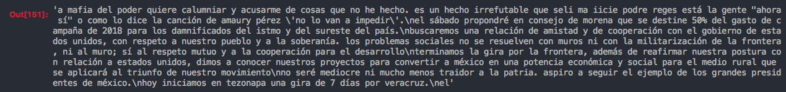
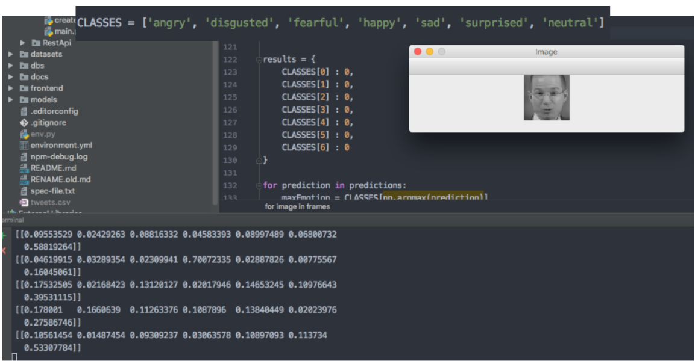
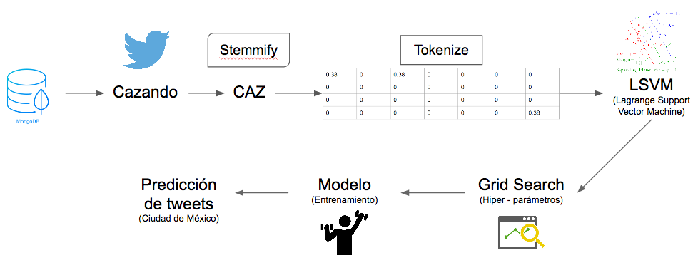
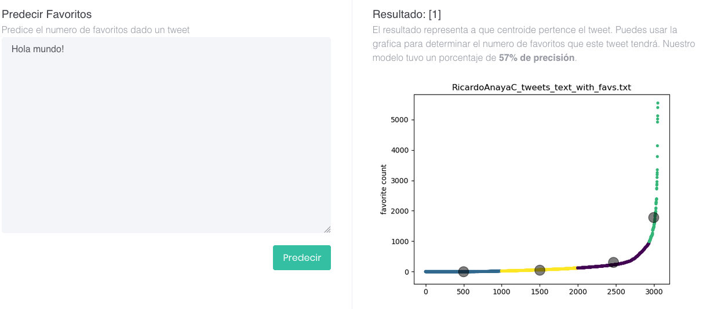
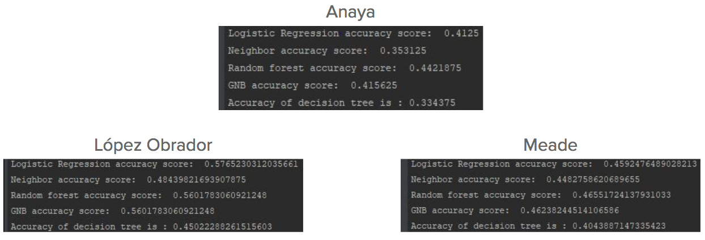
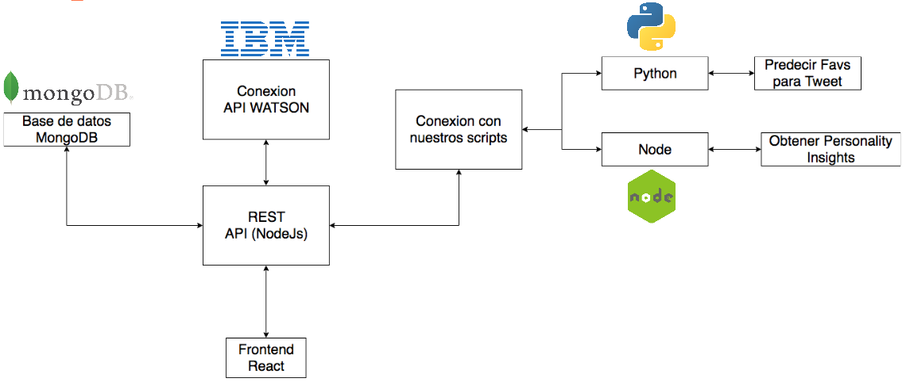
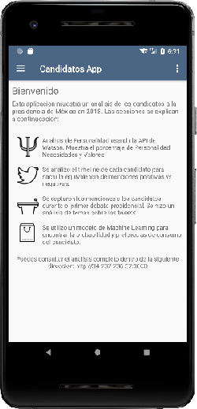

# Mercadotecnia Personal
---
#### Equipo *Mojojojos*

##### Campus: Ciudad de México

##### Integrantes:
1. Ernesto Pérez Martínez
2. Ketzia Lizette Dante-Hidalgo Bouchot
3. Guillermo Barrientos González
4. Gustavo Francisco Méndez De La Cruz
5. Jose Jorge Figueroa Figueroa

---
## 1. Aspectos generales

### 1.1 Requerimientos técnicos

A continuación se mencionan los requerimientos técnicos mínimos del proyecto, favor de tenerlos presente para que cumpla con todos.
* El equipo tiene la libertad de elegir las tecnologías de desarrollo a utilizar en el proyecto, sin embargo, debe tener presente que la solución final se deberá ejecutar en una de las siguientes plataformas en la nube: [IBM Cloud](https://www.ibm.com/cloud/) o [Google Cloud Platform](https://cloud.google.com/?hl=es).
* El proyecto debe utilizar algunos de los servicios disponibles en las plataformas anteriores.
* La solución debe utilizar una arquitectura de microservicios. Si no tiene conocimiento sobre este tema, le recomendamos la lectura [*Microservices*](https://martinfowler.com/articles/microservices.html) de [Martin Fowler](https://martinfowler.com).
* La arquitectura debe ser modular, escalable, con redundancia y alta disponibilidad.
* La arquitectura deberá estar separada claramente por capas (*frontend*, *backend*, *API RESTful*, datos y almacenamiento).
* Los diferentes componentes del proyecto (*frontend*, *backend*, *API RESTful*, bases de datos, entre otros) deberán ejecutarse sobre contenedores [Docker](https://www.docker.com/) y utilizar [Kubernetes](https://kubernetes.io/) como orquestador. Tanto [IBM Cloud](https://www.ibm.com/cloud/) como [Google Cloud Platform](https://cloud.google.com/?hl=es) permiten el uso de estas tecnologías.
* Todo el código, *datasets* y la documentación del proyecto debe alojarse en este repositorio de GitLab que en [Nearshore Delivery Solutions](http://nearshoremx.com/) habilitamos para tales efectos. Favor de mantener la estructura de carpetas generada.

### 1.2 Estructura del repositorio
El proyecto debe seguir la siguiente estructura de carpetas, la cual generamos por usted:
```
- / 			        # Raíz de todo el proyecto
    - README.md			# Archivo con los datos del proyecto (este archivo)
    - frontend			# Carpeta con la solución del frontend (Web app)
    - backend			# Carpeta con la solución del backend (CMS)
    - api			# Carpeta con la solución de la API
    - datasets		        # Carpeta con los datasets y recursos utilizados (csv, json, audio, videos, entre otros)
    - dbs			# Carpeta con los modelos, catálogos y scripts necesarios para generar las bases de datos
    - models			# Carpeta donde se almacenarán los modelos de Machine Learning ya entrenados
    - docs			# Carpeta con la documentación del proyecto
        - stage_1               # Documentos de la primera entrega
        - stage_2               # Documentos de la segunda entrega
        - stage_3               # Documentos de la entrega final
        - manuals               # Manuales y guías
```

### 1.3 Documentación  del proyecto

Como parte de la entrega final del proyecto, se debe incluir la siguiente información:

* Justificación del modelo de *Machine Learning* que seleccionaron.
* Descripción del o los *datasets* y las fuentes de información utilizadas.
* Guía de configuración, instalación y despliegue de la solución en la plataforma en la nube  seleccionada ([IBM Cloud](https://www.ibm.com/cloud/) o [Google Cloud Platform](https://cloud.google.com/?hl=es)).
* Documentación de la API. Puede ver un ejemplo en [Swagger](https://swagger.io/).
* El código debe estar documentado siguiendo los estándares definidos para el lenguaje de programación seleccionado.

## 2. Descripción del proyecto

El proyecto se trata de una plataforma que permite a los candidatos mediante el uso de Big Data
y Machine Learning analizar diferentes datos de la población mexicana, como sus intereses, personalidad y reacciones al contenido que éstos
postean en redes sociales, así como analizar la manera en que estas características empatan con los contenidos de los tweets y videos publicados por los candidatos.
Dicho análisis además permitirá a los candidatos costumizar su campaña para así poder llegar a impactar a un mayor número de personas y atraer nuevos votantes.

Se hace uso de muchas tecnologías para el funcionamiento total del proyecto.
Es posible instalar el proyecto y correrlo siguiendo las instrucciones de instalacion en este mismo documento. 

Sin embargo si se encuentran problemas al instalar el proyecto, hemos hecho la instalación dentro de un servidor en Amazon AWS y es posible consultarlo en la siguiente dirección:
1. [Frontend](http://34.237.236.57:3000) 
2. [REST API](http://34.237.236.57:8005)


## 3. Solución

A continuación aparecen descritos los diferentes elementos que forman parte de la solución del proyecto.

### 3.1 Técnica de *Machine Learning* utilizada

#### Generador de discurso basado en tweets


Se hizo uso de una red neuronal LSTM (Long Short-tem memory) cuya finalidad es aprender de un bloque de texto para generar contenido nuevo basado en un input de 100 caracteres.

El numero de caracteres lo seleccionamos de manera arbitraria y el código se encuentra dentro de backend/Python/GeneradorDiscurso.ipynb

La idea para esta red neuronal es aprender las frases o manera de hablar de un candidato basado en los tweets con mas favoritos dentro de su timeline.
Para contar con una herramienta para generar discursos nuevos desde 0. Por falta de tiempo se aplico solo para AMLO, pero puede ser aplicado a cualquier archivo de texto (ver Jupyter Notebook)

La arquitectura de la red consiste de: 
* Una capa LSTM de 400 unidades 
* Una capa de Dropout para reducir el error de 0.2
* Una capa de LSTM de 400 unidades
* Una capa de Dropout para reducir el error de 0.2
* Una capa de LSTM de 400 unidades
* Una capa de Dropout para reducir el error de 0.2
* Una capa Densa con tipo de activación ‘softmax’

Las capas fueron añadidas de manera secuencial y la red fue entrenada por un total de 100 épocas con un batch size de 50. El entrenamiento se realizo en una instancia M3 de Amazon EC2.

Los resultados para el input: *la mafia del poder quiere calumniar y acusarme de cosas que no he hecho. es un hecho irrefutable que q*
fueron los siguientes:




#### Predictor de emociones


Se hizo uso de una **Red Neuronal Convolucional** (http://cs231n.github.io/convolutional-networks/) para entrenar un modelo con TFLearn que es capaz de identificar emociones presentes en un video.

La idea es simple, utilizar un dataset que este etiquetado con emociones y la red neuronal encontrara los patrones para identificar imagenes nuevas.

El dataset utilizado es parte de la Face Recognitivo Challenge de Kaggle en el 2013, es posible descargarlo de la siguiente liga: (https://www.kaggle.com/c/challenges-in-representation-learning-facial-expression-recognition-challenge)
o usando la Kaggle Api: ```kaggle competitions download -c challenges-in-representation-learning-facial-expression-recognition-challenge```

Utilizamos una red neuronal convolucional ya que ha tenido grandes avances en los ultimos anios y es un gran metodo de clasificacion de imagenes, cabe destacar que las redes neuronales mas recientes para identificar imagenes son las llamadas *Capsule Networks* de Hinton et al.

Nuestra red neuronal esta basada en AlexNet (https://papers.nips.cc/paper/4824-imagenet-classification-with-deep-convolutional-neural-networks.pdf) y el codigo para recrearla se encuentra dentro de: **backend/Python/processVideo.py**


#### Clasificador de sentimiento (Texto)


Se hizo uso de una **LSVM (Linear Support Vector Machine)**, el motivo detras del uso de una LSVM en contraste con una red neuronal es que las LSVMs estan probadas como uno de los metodos mas eficaces de clasificacion de texto.

Asi mismo, su arquitectura y diseño hacen de este modelo de ML el ideal para una clasificacion binaria (en este caso clasificamos tweets como Positivo vs Negativo)

Utilizamos SKLearn junto con su soporte nativo para stemmificacion y tokenizacion asi como un grid search para encontrar los mejores hiper parametros.

El codigo puede ser encontrado dentro de **backend/Python/utilities/modelgen.py**

#### Prediccion de Favoritos


Se hizo uso de varios modelos de Machine Learning y varias iteraciones para encontrar el mejor modelo a utilizar. Los modelos probados fueron:
- Decision Tree
- Logistic Regression
- K-Nearest-Neighbors
- Gaussian Naive Bayes
- Random Forest

Al final el mejor clasificador resulto ser el **Random Forest**, como es posible observar en la siguiente captura de ejecucion:


Dado que los tweets de los candidatos contaban con una cantidad muy dispersa de favoritos se decidio utilizar K-means para clasificar y agrupar el numero de favoritos en 4 centroides.

De tal manera que si el resultado apunta al centroide numero 1 significa que el numero de favoritos se encuentra en cierto rango, dependiendo de la grafica generada por K-means.

El codigo se puede encontrar en **backend/Python/create_tweet_prediction_model.py**

### 3.2 Arquitectura de la solución




### 3.3 Frontend
Para el frontend decidimos utilizar React.js

#### 3.3.1 Lenguaje de programación
El lenguaje utilizado es Javascript usando ES6, todo corre con dependencias de Node.js y npm

#### 3.3.2 Framework
React.js

#### 3.3.3 Librerías de funciones o dependencias
Las librerias utilizadas son:
1. Axios: Utilizado para realizar requests a la REST api (https://github.com/axios/axios)
2. Recharts: utilizado para generar las graficas en SVG de manera responsiva. (https://github.com/axios/axios)

### 3.4 Backend

#### 3.4.1 Lenguaje de programación
##### Python :
Se utilizo python para la generacion de modelos de Machine Learning, evaluacion y creacion de datasets.
##### Javascript (Node.js):
Se utilizo Node.js para la obtencion de datos como timelines de twitter y hacer uso de personality insights asi como la REST API
##### R:
Se utilizo R para generar algunas graficas y limpiar datasets de manera rapida y concisa
##### Java:
Se utilizo Java para generar una aplicacion en android que contiene los puntos mas importantes de este analisis. Se incluye el codigo completo dentro de **/backend/Candidatos-Android-App**



#### 3.4.2 Framework
#### 3.4.3 Librerías de funciones o dependencias
*[A continuación enlistamos las librerías más importantes que utilizamos en nuestro proyecto]*

#### Node:
* fs :lectura y escritura de archivos.
* Twit : extracción de tweets.
* Discovery (IBM WATSON): watson-developer-cloud/discovery/v1 análisis de anomalias y extracción de noticias.
* Personality Insights : watson-developer-cloud/personality-insights/v3 análisis de personalidad y preferencias de consumo.
* twitter : extracción de tweets.
#### Python:
* pandas: manejo de dataframes.
* numpy: manejo de vectores y matrices.
* sklearn: utilizar modelos de machine learning.
* nltk: procesamiento de lenguaje natural.
* lxml: procesamiento de xml y html.
* matplotlib: uso de gráficas.
* pytube: extracción de videos de YouTube.
* opencv: procesamiento de imagenes 

*[A continuación enlistaremos las diferentes utilidades que creamos en nuestro proyecto]*

#### Python:
 * imageprocessor: Se encarga del procesamiento de frames en un video y de la predicción de emociones.
 * modelgen: Se realiza el proceso de stemmificación, tokenización, y generación de modelos para la definción de tweets positivos y negativos.
 * youtubedownloader: Extracción de videos de YouTube.
 * topicmodelling: Se encarga de la clasificación de texto en tópicos.
 * tassutilites: Se encarga de la limpieza de dataframes para su posterior uso en el entrenamiento y prueba de algoritmos de Machine Learning.
 * twitterparser: Extracción y limpieza de tweets.
 * evaluateDebateTweets: evaluar el sentimiento de los tweets generados por usuarios durante el debate presidencial.
   
#### Node:
 * DiscoveryUtilites: Se encarga de hacer las peticiones al endpoint del servicio de Discovery de IBM Watson para la extracción de noticias relevantes
 * GetYouTubeComments: Se encarga de la extracción y limpieza de comentarios de YouTube dado un vídeo específico
 * PersonalityUtilities: Se encarga de hacer las peticciones al endpoint del servicio Personality Insights y Consumer Needs de IBM Watson
 * GetTwitterStream: Se encarga de la extracción de tweets tanto de candidatos como de menciones a los candidatos por lotes
 * TwitterUtilities: Se encarga de la extracción de tweets con ciertos filtros como la localización.

*[Finalmente enlistaremos los ejecutables que realizamos para cada módulo del sistema]*

#### Python:
 * evaluate_candidate_tweets : evaluar los tweets de cada candidato para calcular su sentimiento
 * generate_lsvm_model: Generar modelo utilizando el algoritmo de Linear Support Vector Machines
 * generateMaps: Generar mapas para identificar en que zonas de la CDMX la gente twitea más y que sentimientos predominan por zona
 * create_tweet_prediction_model: Crear el modelo de predicción que sirve para predecir el número de favoritos que tendrá un twit dado
 * generate_word_cloud: Generar el wordcloud de cada candidato
 * GeneradorDiscurso.ipynb: Genera toda la logica necesaria para crear el predictor de discurso.

#### Node:
  * getUserMentions: extraer menciones de candidatos

### 3.5 API

Se incluye toda la documentación pertinente de la REST API dentro de **docs/api** . 
Recomendamos consultarla desde ese archivo.

Así mismo se incluye la especificación de swagger como json y yml dentro de **/api**


#### 3.5.1 Lenguaje de programación
##### Javascript (node.js)
Se utilizo javascript para lanzar un servidor http con node.js usando express.js

#### 3.5.2 Framework
##### Express.js
Express se uitilizo para hacer uso de la Rest-API, no se uso ningun framework adicional a este.

#### 3.5.3 Librerías de funciones o dependencias
Las depdencias utilizadas en la rest api son:
1. Dotenv: para cargar variables de entorno dentro de la aplicación
2. express: framework para usar el servidor http
3. mongoose: para conectarnos con la base de datos en mongodb
4. python-shell: para ejecutar scripts en python desde node
5. watson-developer-cloud: para utilizar los servicios de consulta de datos en discovery


## 3.6 Pasos a seguir para utilizar el proyecto

### Usando docker (Preferentemente)
1. Clonar el repositorio ``git clone git@git.nearshoremx.com:catedra-computo/CCM/Mercadotecnia_Personal.git``
2. Una vez clonado el repositorio, descargar los datasets proporcionados en el siguiente link: https://drive.google.com/open?id=10NRddRcqjX8v9GgJvIS7J10WpeA8eIYY
3. Una vez descargados los datasets, incluirlos dentro de la carpeta datasets
4. Descargar los modelos pre-entrenados de la siguiente direccion: https://drive.google.com/open?id=186bp5fggU8PrWvKM8Ory-n0aX4oe146b
5. Una vez descargados los modelos pre-entrenados incluirlos dentro de la carpeta models
6. Utilizamos dotenv para el manejo de credenciales y datos sensibles.
Por ende se deben de crear dos archivos con el nombre de .env dentro de : *backend/Node* y de : */api*, se incluyen archivos .env.example que sirven para ver la estructura de este archivo.
Adicionalmente se pueden bajar los .envs que utilizamos de la siguiente liga: https://drive.google.com/open?id=1hfnYUDMdaW3vw5QRQ8qx44uftLBUOKhr pedimos a los responsables utilizar las credenciales con medida y cuidado, se desactivaran al finalizar el semestre.
6. Instalar docker: https://docs.docker.com/install/ seguir las instrucciones oficiales
7. Una vez instalado docker, instalar docker-compose (La mayoria de instaladores instalan docker junto con docker-compose) https://docs.docker.com/compose/
8. Al tener instalado docker y docker-compose asegurarse que el daemon de docker esta corriendo.
9. Abrir una nueva terminal y navegar a la ubicacion del proyecto: ```cd ProyectoFinal```
10. Ejecutar ```docker compose up```, esto instalara todas las dependencias del proyecto para usar el frontend y la REST API
11. Una vez terminada la instalacion y con el contenedor corriendo es posible ejecutar ```docker exec -it REST-api bash``` para usar la terminal integrada del contenedor.
12. Dado que nuestro backend se conecta con python para ejecutar el predictor de tweets es necesario instalar las dependencias para ejecutar los scripts de python.
13. Para eso ejecutamos el comando ```docker exec -it REST-api bash``` para acceder a la terminal interactiva del contenedor.
14. Una vez dentro de la terminal activamos el env de conda que se creo al crear el contenedor de docker: ```source activate CognitivaProyFinal```
15. Navegamos a ```cd /usr/src/app/backend/Python```
16. Ejecutamos ```pip install -r requirements.txt``` y esperamos a que se instalen todas las dependencias del proyecto.
17. Descargar los archivos del frontend de aqui: https://drive.google.com/open?id=1QVEeOzXatetdoiLZQ4nurh7FqHn5-fbz , descomprimirlos y meterlos dentro de: frontend/public
17. El proyecto esta listo para utilizarse! Navegar a http://localhost:3000 para visualizarlo
18. Nota impotante: no encontramos la manera de guardar los cambios y hacerlos automaticos por lo que la instalacion de las dependencias con pip tiene que ser hecha cada vez que se inicia el contenedor de docker.

### Instalacion Manual
Si la instalacion de docker no funciona, es posible instalar todas las dependencias de manera manual y correr cada componente por separado
1. Instalar node.js (Preferentemente version > 6.x) https://nodejs.org/es/
2. Instalar python y pip
3. Instalar Anaconda https://www.anaconda.com/download/
4. Seguir los pasos de arriba para descargar e incluir los datasets envs y modelos pre-entrenados
4. Instalar mongodb y configurar una base de datos (opcional, se creo una base de datos remota para la facilidad de uso)  https://www.mongodb.com/
5. Una vez instaladas las dependencias requeridas es momento de crear un environment de conda que contiene todas las librerias utilizadas en el proyecto
6. Creamos un nuevo environment con el siguiente comando: ```conda create --name CognitivaProyFinal python=3.5.4 -y```
7. Una vez creado el environment debemos activarlo: ```source activate CognitivaProyFinal```
8. Navegamos al directorio de Python que contiene las dependencias requeridas: ```cd ProyectoFinal/backend/Python```
9. Dentro del directorio ejecutamos ```pip install -r requirements.txt```
10. Tomamos nota de el ejecutable de python de este environment corriendo: ```conda env list```, queremos guardar el path de el environment "CognitviaProyFinal"
11. Dentro del .env en */api/* cambiamos el path para que coincida con el env utilizado, tomando en cuenta llegar hasta el ejecutable python3.5
12. La aplicacion esta lista para utilizarse y consiste de 3 partes: El frontend, la restapi y todos los scripts dentro de Python.
13. Si se desea hacer uso de los scripts en Python es necesario activar el environment creado y ejecutar cualquier script que se requiera.
14. Para correr la aplicacion abrir una nueva terminal y navegar a /api ```cd api``` y ejecutar ```npm install``` (Solo es necesario en la primera ejecucion)
15. Una vez instaladas las depdencias ejecutar ```node server.js```
16. Una vez corriendo el backend podemos ir a /frontend ```cd frontend``` y ejecutar ```npm install```
17. Descargar los archivos del frontend de aqui: https://drive.google.com/open?id=1QVEeOzXatetdoiLZQ4nurh7FqHn5-fbz , descomprimirlos y meterlos dentro de: frontend/public
17. Ejecutar ```npm start``` una vez instaladas las dependencias
18. Navegar a http://localhost:3000
19. Listo!

## 4. Referencias

* http://www.sepln.org/home-2/la_sepln/
* https://www.ibm.com/cloud/
* https://www.kaggle.com/c/challenges-in-representation-learning-facial-expression-recognition-challenge
* https://papers.nips.cc/paper/4824-imagenet-classification-with-deep-convolutional-neural-networks.pdf
